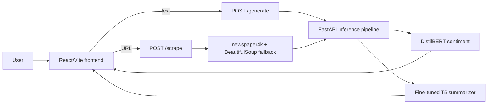

# NewsScribe

NewsScribe is a full-stack news summarization app. It accepts pasted article text or a news URL, extracts the article body when needed, generates a short abstractive summary with a fine-tuned T5 model, and returns a lightweight sentiment signal with latency metadata.


## What It Does

- Summarizes pasted news text through `POST /generate`.
- Scrapes and summarizes public article URLs through `POST /scrape`.
- Uses a fine-tuned T5 model for abstractive headline/summary generation.
- Adds sentiment metadata with a locally saved DistilBERT SST-2 classifier.
- Shows latency, input token count, device, sentiment, and confidence in the UI.
- Lets the user copy the result or export it as a PDF report.

## Tech Stack

| Area | Tools |
| --- | --- |
| Frontend | React, Vite, Tailwind CSS, jsPDF |
| Backend | FastAPI, Pydantic, Uvicorn |
| ML | PyTorch, HuggingFace Transformers, T5, DistilBERT |
| Scraping | newspaper4k, BeautifulSoup |
| Deployment | Docker backend, GitHub Actions, DockerHub, EC2/Nginx |

## Architecture



The backend is intentionally stateless. Model files are not committed to git; they are mounted or placed locally under `backend/model_weights` and `backend/sentiment_model`.

## Key Engineering Decisions

| Decision | Why |
| --- | --- |
| React frontend + FastAPI backend | Keeps the browser UI separate from the Python ML runtime. |
| T5 for summarization | Fits the text-to-text summarization task and was fine-tuned in the project notebook. |
| DistilBERT for sentiment | Adds a quick side signal without making the summarization path much heavier. |
| `newspaper4k` plus BeautifulSoup fallback | News websites vary a lot; a second extraction path improves URL handling. |
| CPU-first inference settings | The deployed backend targets a small CPU host, so generation uses short input windows, greedy decoding, KV cache, and limited PyTorch threads. |
| Host-mounted model artifacts | Keeps Docker images smaller and avoids storing large model weights in git. |

## Challenges I Solved

- **Article extraction quality:** `newspaper4k` sometimes returned short boilerplate text, so I added a BeautifulSoup fallback that removes layout tags and rebuilds content from meaningful paragraphs.
- **CPU latency:** Early generation settings were too slow for a small host. I removed beam search, capped input/output lengths, enabled cache usage, and limited PyTorch thread counts to reduce CPU thrashing.
- **Model packaging:** Large T5 and sentiment weights made the repo and image heavy, so I moved model files outside git and load them from mounted directories.
- **Container reliability:** NLTK article parsing needed runtime data, so the Dockerfile downloads `punkt` and `punkt_tab` during build and the app points NLTK at the baked-in folder.
- **Tokenizer compatibility:** The project went through tokenizer/model loading fixes before settling on a stable T5 tokenizer load path and local model weights.

## Current Limitations

- No automated tests yet.
- No database, user accounts, request history, or feedback loop.
- The `/scrape` route can still fail on paywalled, blocked, or JavaScript-heavy pages.
- CORS is currently permissive and should be restricted for a hardened public deployment.
- Sentiment is binary positive/negative, which is too simple for many news articles.
- The health endpoint only checks that the API process is alive, not that model files are loaded correctly.

## What I Would Improve Next

1. Add FastAPI response models, request size limits, and structured error codes.
2. Add unit tests for scraping helpers and integration tests for `/generate` and `/scrape`.
3. Make model paths, thread counts, and generation settings environment-configurable.
4. Add a readiness endpoint that confirms both models are loaded.
5. Tag Docker images by commit SHA so rollback is safer than redeploying `latest`.
6. Track ROUGE plus small human checks on real news URLs to separate extraction errors from model errors.

## Project Structure

```text
backend/
  main.py                 FastAPI app, scraping, inference pipeline
  Dockerfile              CPU backend image
  download_sentiment.py   Saves the sentiment model locally
  requirements.txt
frontend/
  src/App.jsx             Main React UI and API client
  src/index.css           Tailwind theme and base styles
notebooks/
  headline_gen.ipynb      T5 fine-tuning experiment on CNN/DailyMail
docs/
  TECHNICAL_NOTES.md      Concise interview notes and design rationale
SETUP.md                  Local setup steps
```

## Running Locally

See [SETUP.md](./SETUP.md) for the exact local steps.

Short version:

```bash
cd backend
python -m venv venv
venv\Scripts\activate
pip install -r requirements.txt
uvicorn main:app --reload --port 8000
```

```bash
cd frontend
npm install
npm run dev
```

Set `VITE_API_URL=http://127.0.0.1:8000` for the frontend if needed.

## API

| Method | Path | Body | Purpose |
| --- | --- | --- | --- |
| `GET` | `/` | none | Health check |
| `POST` | `/generate` | `{ "text": "..." }` | Summarize pasted text |
| `POST` | `/scrape` | `{ "url": "https://..." }` | Extract and summarize a URL |

Example response:

```json
{
  "summary": "Generated summary text.",
  "metadata": {
    "latency_ms": 1234.56,
    "input_tokens": 320,
    "device": "cpu",
    "sentiment": "POSITIVE",
    "score": 0.9876
  }
}
```
